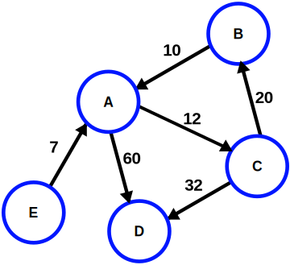

# 第12章　ダイクストラのアルゴリズム

## 12.1　グラフ上の最短経路問題

最短経路問題を解くにはまず、経路を「重みつきグラフ」という構造で表現する必要がある。

グラフとは、複数の点が辺でつながっている構造のこと。  
そして、各辺に重みが定義されているグラフを、重みつきグラフという。  
重みとは、点と点の間の距離などを抽象化したもの。

以下が重みつきグラフの例。

なお、このグラフでは点と点の移動は一方向だが、本書で扱うメトロネットワークは双方向である。

最短経路問題は、重みつきグラフ、始点、終点が与えられたときに、始点から終点に至る道で最も重みの和が少ない経路を探す問題、といえる。

## 12.2　ダイクストラのアルゴリズム

ダイクストラのアルゴリズム（ダイクストラ法）は、重みつきグラフ上の最短路を求めるアルゴリズム。

このアルゴリズムは、全ての点に対して、始点からの最短距離を求めていく。  
特定の点についてのみ最短距離を調べるわけではない。

**ダイクストラのアルゴリズム**

1. 始点への最短距離は`0`と確定する。それ以外の点への最短距離は暫定的に`無限大`としておく。
2. `U`を最短距離が確定した点の集合、`V`を最短距離が確定していない点の集合とする。最初は`U`には始点のみが入っており、`V`には始点以外の全ての点が入っている。
3. `V`が空集合になったら、全ての点の最短距離が確定したことになるので、終了する。
4. 直前に確定した点とつながっている全ての点に対して、以下の処理を行う。
    - 対象となる点が既に持っている最短距離と、直前に確定した点を経由してその点に行った場合の最短距離を、比較する。
    - 距離が短いほうを、その点の最短距離とする。
5. `V`の中で、最短距離が最小の点`p`を選択する。
6. `p`の最短距離を確定とし、`p`を`V`から`U`に移す。
7. `3.`へ。

上記のアルゴリズムを実行することで、全ての点について、始点からの最短距離が確定する。

本書で扱うメトロネットワーク最短経路問題では、最短距離に加えて、経路の情報も各点が持つようにする。

## 12.3　アルゴリズムの正当性

ダイクストラのアルゴリズムでは、重みが負の値でない限り、正しく最短経路を求めることが出来る。

## 12.4　プログラムにおける頂点と辺の定義

メトロネットワーク最短経路問題。

ダイクストラのアルゴリズムを使うために必要なレコードや関数を用意した。

## 12.5　駅名の重複の除去

メトロネットワーク最短経路問題。

[metro.ml](../metro.ml)で定義してある`global_ekimei_list`には、駅の重複がある。  
これは、路線ごとに駅を登録しているから。そのため、複数の路線に所属している駅は複数登録されている。  
だがダイクストラのアルゴリズムを使うためには、ひとつの駅はひとつの点で表される必要がある。  
そのため、`global_ekimei_list`から重複を取り除く関数を作る。
